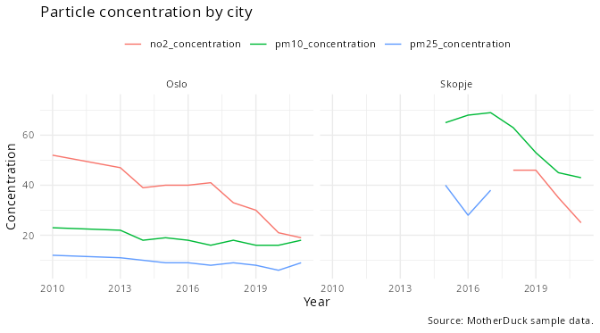

With DuckDB [releasing](https://duckdb.org/2024/06/03/announcing-duckdb-100.html) 
version 1.0.0 on June 3rd, and MotherDuck [following](https://motherduck.com/blog/announcing-motherduck-general-availability-data-warehousing-with-duckdb/) with the general availability announcement on June 11th, it is a perfect 
opportunity to see how both can be used from `R`. I work for an organization where
`R` is the default language for doing most of the analytics, so being able to do
this is more than just simple curiosity. 

### My setup

I am running `R` version 4.4.1 on Linux, with `duckdb` [version](https://r.duckdb.org/) 1.0.0.

I have `python` version 3.12, and I am installing `duckb` 1.0.0 in a virtual environment.

I installed the `duckdb` version 1.0.0 binary as well, and [installed](https://duckdb.org/docs/extensions/overview.html) the `motherduck` extension.

And, of course, I also have created an account on [MotherDuck](https://motherduck.com/). 

### Running duckdb in R

This has been probably [covered](https://duckdb.org/docs/api/r) many times so
far. Nevertheless, for completeness, running `duckdb` in `R` is fairly straight 
forward:

```
# Connect to an in-memory DuckDB database
con <- dbConnect(duckdb::duckdb(), ":memory:")

# Write the Iris dataset to the DuckDB in-memory database
dbWriteTable(con, "iris", iris)

# Query data from the DuckDB database
data <- dbGetQuery(con, "SELECT * FROM iris")

```

Of course there is the possibility of doing things with [duckplyr](https://duckdblabs.github.io/duckplyr/), but we are not going to go into that. 

### Connecting to MotherDuck

MotherDuck documentation has details about [connecting](https://motherduck.com/docs/getting-started/connect-query-from-python/installation-authentication) to MotherDuck using `python`, but not for connecting using `R`.

After asking few question on the discord, I learned that the process should be similar. 

Let's see how that looks.

#### Python

In a Python 3.12 virtual environment, that has `duckdb-1.0.0`, getting to 
MotherDuck is simple, in fact as the documentation says:

```
import duckdb

# connect to MotherDuck using 'md:' or 'motherduck:'
con = duckdb.connect('md:')
```

The above results in getting a notification on the terminal:

```
Attempting to automatically open the SSO authorization page in your default browser.
1. Please open this link to login into your account: https://auth.motherduck.com/activate
2. Enter the following code: XXXX-XXXX
```

Nothing else is required here. We click in the browser, establish a connection, get a token, etc.


#### R

However, doing the same with R doesn't have the same outcome:

```
con <- DBI::dbConnect(duckdb::duckdb(), "md:")
```

Creates a local database called `md:`:

```
ls -lh md\: 
-rw-r--r-- 1 novica novica 12K jun 21 10:32 md:
```

My best guess here is that the `duckdb` package for `R` does not automatically 
figure out that it should load the `motherduck` extension, as is probably the case
in `python`.

The approach in R is then similar to what is suggested in the section
[Connecting to MotherDuck after opening a local DuckDB database](https://motherduck.com/docs/getting-started/connect-query-from-python/installation-authentication#connecting-to-motherduck-after-opening-a-local-duckdb-database):

```
# Create a local database
con <- DBI::dbConnect(duckdb::duckdb(), "local.duckdb")


# Note: Installing the extension is not nececsary here since 
# I already have it installed on my system. However, if you don't want
# to go to the trouble of installing the duckdb binary and then installing
# extensions, then it is possible to do the installation here before
# loading with:
# DBI::dbExecute(con, "INSTALL 'motherduck';")

# Load the Mother Duck extension
DBI::dbExecute(con, "LOAD 'motherduck';")


# Verify that the extension is loaded
DBI::dbGetQuery(
  con,
  "SELECT extension_name, loaded, installed FROM duckdb_extensions() WHERE
  extension_name = 'motherduck'"
)

# Connect to MotherDuck
DBI::dbExecute(con, "PRAGMA MD_CONNECT")
```

At which point the message for authenticating in the browser shows up in the terminal.

After approving the connection, as the friendly message says, the token can be
stored in an environment variable to avoid having to log in again.

Then it is a simple matter of querying things on MotherDuck:

```
# Query the sample data about air quality that is avaiable on MotherDuck
DBI::dbGetQuery(
  con,
  "SELECT country_name, city, \"year\", pm10_concentration, pm25_concentration, no2_concentration, FROM sample_data.who.ambient_air_quality WHERE  city = 'Skopje' OR city = 'Oslo';"
)
```

Note that we have to specify the database name: `sample_data`, and the 
schema: `who` to query the data on MotherDuck.

The results can be assigned to a object in R, which I did. And since it is 
always fun to make a plot here is how it looks for the two cities where I 
spend most of my time.



And, that's a wrap. I mean a quack. :)