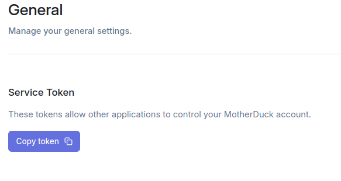

In a previous post I wrote about how to [connect to MotherDuck from R](post/joining-the-flock-from-r-working-with-data-on-motherduck/). However, 
the process described there, where you click in the browser to authenticate, 
wouldn't really work with a Shiny app, or for that matter with any productionized
setup. And R without Shiny is like pizza without pineapple. So let's see how to 
set up a Shiny that will run some queries on `MotherDuck`.

If you recall, there is a token that is used to authenticate to `MotherDuck`. You 
can go back to the previous post to see how to obtain the token via R, or you can 
log into setting on your `MotherDuck` account and simply copy it from there.



After that, store that in an environment variable. You could save it permanently
in `.Renviron` or just use `Sys.setenv()` if you are trying out things. Anyway 
you should verify that the token is available when running `Sys.getenv('MD_TOKEN')`,
where `MD_TOKEN` is what I decided to name this variable.


### Connecting to MotherDuck from the Shiny server

The main part of the Shiny app (well, at least the demo Shiny, scroll down for 
the full code) is establishing a connection to `MotherDuck`. And since the `R` 
version of `duckdb` doesn't automatically load the `motherduck` extension, we 
have to do that step by step:

```
con <- DBI::dbConnect(duckdb::duckdb(), ":memory:")
  
# Install and load the MotherDuck extenstion
DBI::dbExecute(con, "INSTALL 'motherduck';")
DBI::dbExecute(con, "LOAD 'motherduck';")
  
# Define the query to authenticate
auth_query <- glue::glue_sql("SET motherduck_token= {`Sys.getenv('MD_TOKEN')`};", .con = con)
  
DBI::dbExecute(con, auth_query)
  
# Connect to MotherDuck
DBI::dbExecute(con, "PRAGMA MD_CONNECT")
```

Here we create an in-memory duckdb and use that to install and load the extension.
Then we authenticate with the token that is stored in an environment variable.

Note, the `PRAGMA` statement here is [duckdb's way](https://duckdb.org/docs/configuration/overview.html#configuration-reference) 
of "changing the behavior of the system" which is what we are doing with loading 
the extension.

If you run the above code in a normal R script you will still connect to 
`MotherDuck`, which is of course expected.

Then is just about adding the other pats of the shiny app together:


And the whole code below:

```
library(shiny)
library(duckdb)

ui <- fluidPage(
  titlePanel("DuckDB and Shiny Integration"),
  sidebarLayout(sidebarPanel(
    helpText(
      "This app connects to MotherDuck and queries the sample WHO dataset."
    ),
    uiOutput("cities")
  ), mainPanel(tableOutput("data_table")))
)


server <- function(input, output, session) {
  # Connect to an in-memory DuckDB database
  con <- DBI::dbConnect(duckdb::duckdb(), ":memory:")
  
  # Install and load the MotherDuck extenstion
  DBI::dbExecute(con, "INSTALL 'motherduck';")
  DBI::dbExecute(con, "LOAD 'motherduck';")
  
  # Define the query to authenticate
  auth_query <- glue::glue_sql("SET motherduck_token= {`Sys.getenv('MD_TOKEN')`};", .con = con)
  
  DBI::dbExecute(con, auth_query)
  
  # Connect to MotherDuck
  DBI::dbExecute(con, "PRAGMA MD_CONNECT")
  
  cities <- DBI::dbGetQuery(con,
                            "SELECT DISTINCT(city) FROM sample_data.who.ambient_air_quality LIMIT 25;")
  
  output$cities <- renderUI({
    tagList(selectInput(
      inputId = "city",
      label = "City",
      choices = cities
    ))
  })
  
  query_rct <- reactive({
    req(input$city)
    city_name <- input$city
    glue::glue_sql(
      "SELECT country_name, city, \"year\", pm10_concentration, pm25_concentration, no2_concentration, FROM sample_data.who.ambient_air_quality WHERE  city = '{`city_name`}';",
      .con = con
    )
  })
  
  
  data_rct <- reactive({
    req(query_rct())
    message(query_rct())
    DBI::dbGetQuery(con, query_rct())
  })
  
  
  # Render the table output
  output$data_table <- renderTable({
    data_rct()
  })
  
  onSessionEnded({function() {DBI::dbDisconnect(con)} })  
}

shinyApp(ui = ui, server = server)
```

### Closing notes

Since this is just a demo app I am limiting the cities output to 25 to avoid Shiny
complaining about the long vector of city names (8000+). You could obviously modify
that to get cities in Europe or something else. 

The SQL statements can be rewritten in `duckplyr`, but for me it was convenient 
to test a query in `MotherDuck` and just paste it in the `R` code like this.

Of course, it would be better to have dashboard-ready tables (aggregations, summaries) 
that can be used in the Shiny app directly, and something like that can be achieved
with `dbt` or `SQLMesh`, but maybe I will do that in another post.

Finally, I don't recommend deploying this app on [shinyapps.io](https://shinyapps.io).
I tried and it takes too much time to compile and install the `duckdb` package, that I
got a timeout. But it works nicely when running it from `RStudio`.

Happy quacking!